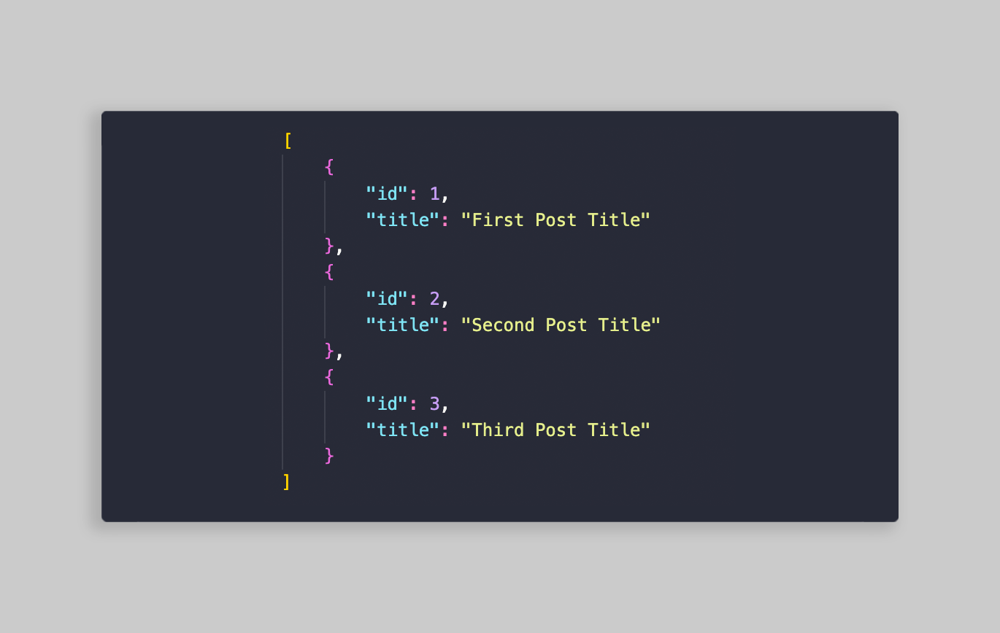
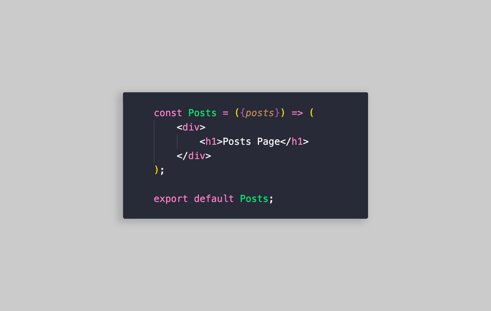
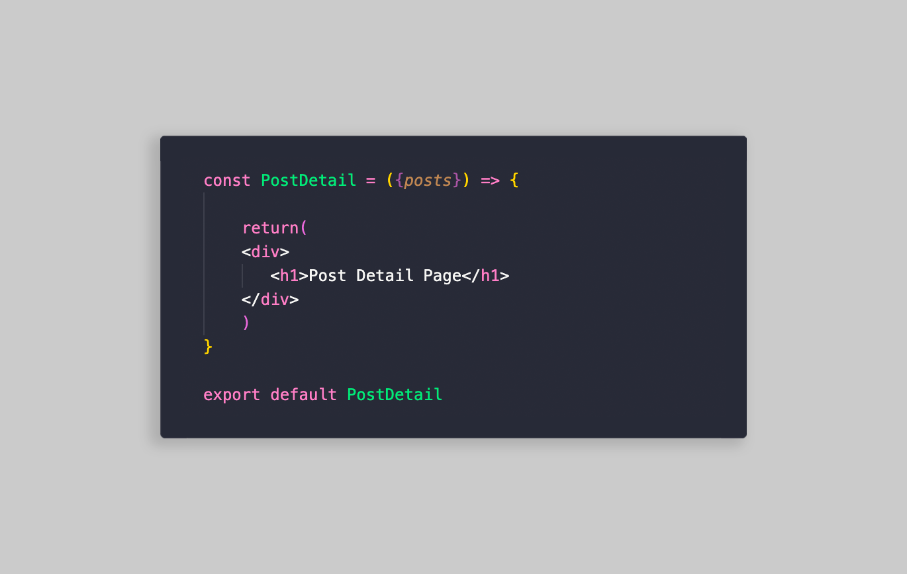
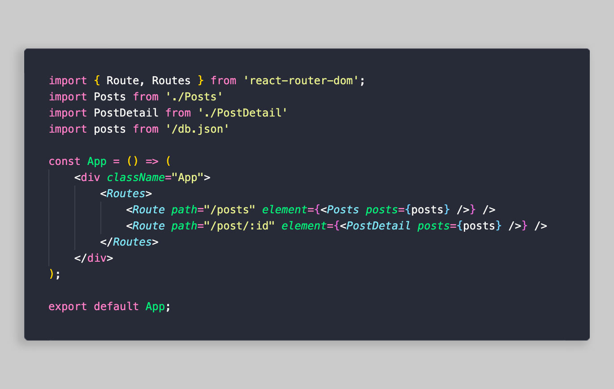
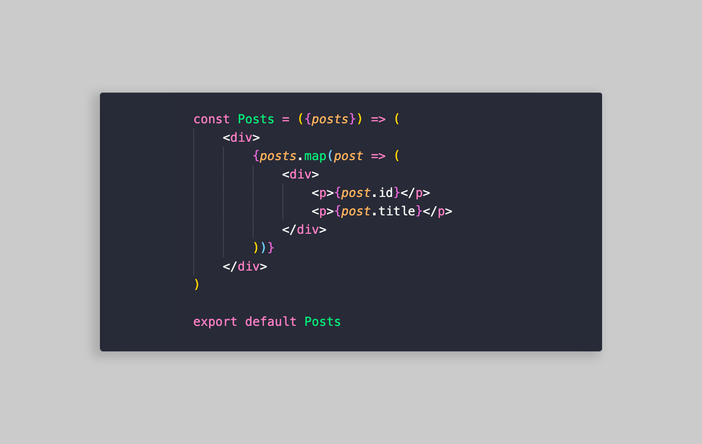
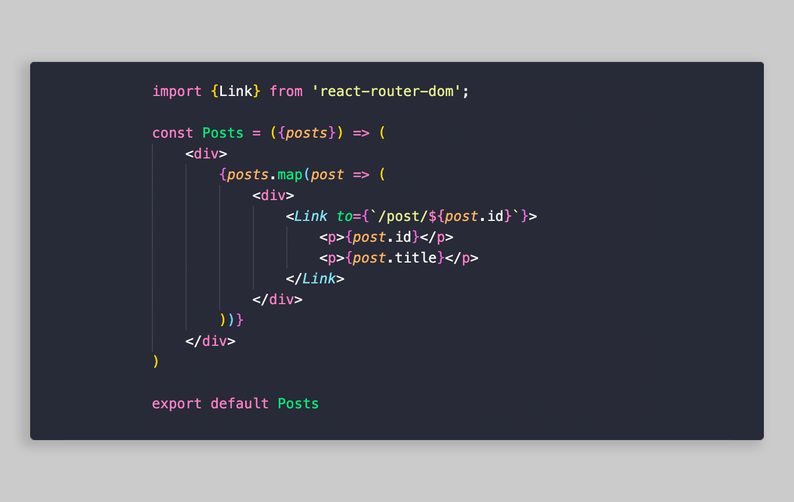
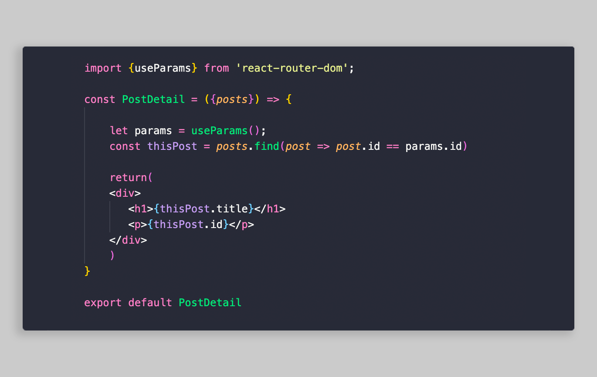

Adding JSON data to your project can be a pretty easy way to display organized content. For this example specifically, we’re adding some hardcoded JSON data to our react project. I’m making the assumption you already have your project folder built out so use this information however you deem fit. 

First, create your .json file which will hold your data:

[db.json]

Then create 2 files which will display said data:

[Posts.js] 

[PostDetail.js]

As you can see, we passed in a variable called posts, let’s make sure at a global level these posts are being imported in. Head on over to your App.js to import your .json data and your Posts and PostDetail.

[App.js]
 

Now, let’s build out our Post and Post Detail page a bit more. 

In our Posts page, we’re gonna map through the .json data and start displaying our content.

[Posts.js]

Now that we’re displaying the data, let’s wrap this in a Link tag imported from react-router. This Link will redirect you to the PostDetails page of that Post.

[Posts.js]

In our PostDetail page we’re going to pull the correct data by identifying the id with the useParams hook, then running a function to pull the right post that matches the id. I’m making it sound more complicated than it is, I promise:

[PostDetail.js]

And that should be all we need to start building out our React Project with JSON Data.